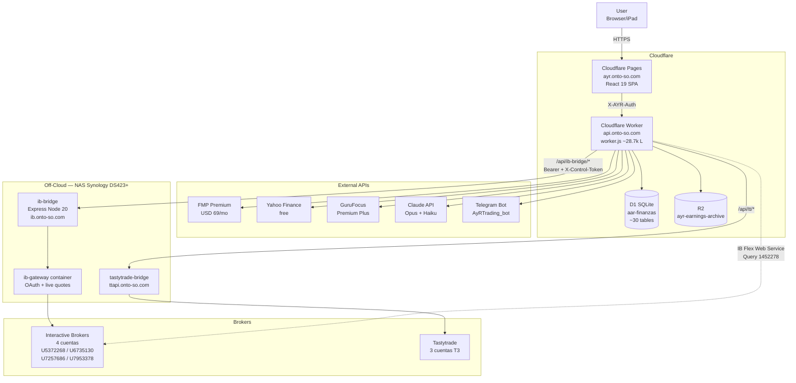
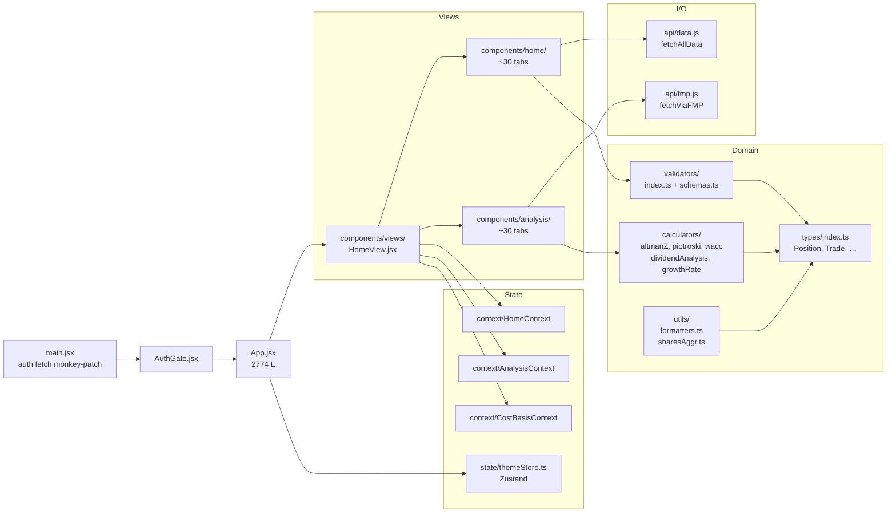
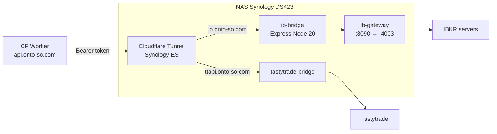

# A&R Architecture

> Snapshot 2026-05-03. Diagrama vivo, actualizar cuando cambien crons,
> bindings, bridges off-cloud o módulos del Worker. Cualquier sesión
> Claude que toque arquitectura debe leer esto + `CLAUDE.md` +
> `docs/bug-patterns.md` antes de proponer cambios.

---

## High-level data flow



Notas clave:

- El custom domain `api.onto-so.com` evita el rango `workers.dev`
  (188.114.96.x) bloqueado desde algunos ISPs (España y China).
- IB Gateway corre off-cloud porque los Workers de Cloudflare salen
  desde IPs que IB bloquea para OAuth interactivo. El bridge en NAS lo
  resuelve y se expone vía Cloudflare Tunnel.
- Igual lógica para Tastytrade: device challenge bloquea Worker IPs.
- El Worker NUNCA toca brokers directamente para escribir; solo lee
  estado vía bridge o Flex.

---

## Frontend module map



Reglas vigentes:

- TypeScript progresivo: `calculators/`, `validators/`, `types/`,
  partes de `utils/` y `state/themeStore.ts` ya en `.ts`/`.tsx`. El
  resto sigue `.jsx` y se migra cuando se toca por feature (ADR-0003).
- Zustand sustituye al patrón Context+Reducer en piezas pequeñas
  (theme primero, ADR-0004). El resto de estado vive en los 3
  Contexts existentes hasta que la Semana 7-9 lo desmonte.

---

## Worker route structure

```mermaid
graph TD
    Fetch[fetch handler]
    CORS[lib/cors.js<br/>buildCorsHeaders]
    Auth[lib/auth.js<br/>requireToken / X-AYR-Auth]
    Mig[lib/migrations.js<br/>ensureMigrations]

    Fetch --> CORS
    CORS --> Mig
    Mig --> Router{Route dispatch}

    Router --> Portfolio[/api/portfolio<br/>/api/positions]
    Router --> Audit[/api/audit/* <br/>full / portfolio / auto-fix]
    Router --> Errors[/api/error-log<br/>/api/errors/*]
    Router --> CostBasis[/api/costbasis/*<br/>JOIN cost_basis + dividendos]
    Router --> Dividendos[/api/dividendos/*]
    Router --> Fundamentals[/api/fundamentals/*<br/>cache 24h en D1]
    Router --> Agents[lib/agents/<br/>11 daily agents]
    Router --> IB[/api/ib-* <br/>OAuth proxy + Flex]
    Router --> Bridge[/api/ib-bridge/*<br/>NAS proxy + auth]
    Router --> TT[/api/tt/*<br/>Tastytrade bridge]
    Router --> Telegram[lib/telegram.js<br/>alertas + dividendos]

    Portfolio --> D1
    Audit --> D1
    Errors --> D1
    CostBasis --> D1
    Dividendos --> D1
    Fundamentals --> FMPx[FMP API]
    Fundamentals --> D1
    Agents --> Claudex[Claude API]
    Agents --> D1
    IB --> Flex[IB Flex Web Service]
    Bridge --> NAS[ib-bridge NAS]
    TT --> TTNAS[tastytrade-bridge NAS]
```

Auth model:

- 30+ endpoints WRITE/sensitive: `X-AYR-Auth` header con
  `AYR_WORKER_TOKEN`. El frontend lo añade vía monkey-patch en
  `main.jsx`.
- `/api/ib-bridge/*` adicionalmente usa `Bearer` token al NAS, y los
  endpoints de control (`/start`, `/stop`) requieren `X-Control-Token`
  separado con allowlist hardcoded.
- CORS strict allowlist: `ayr.onto-so.com` + `ayr-196.pages.dev`. El
  wildcard `*.pages.dev` se quitó por riesgo CSRF.

---

## Cron schedules

Definidos en `api/wrangler.toml` (`[triggers].crons`):

| Schedule (UTC) | Tarea | Cost / runs |
|---|---|---|
| `30 7 * * 1-5` | IB Flex sync diario (lun-vie) → Worker llama al NAS bridge, importa trades + dividendos a D1 | 1 HTTP req. ~22 runs/mes. $0. |
| `0 12 * * *` | News + YouTube refresh diario | $0 |
| `0 8 * * *` | Data Audit diario `/api/audit/full` + Telegram alert si regresión | $0 |

Crons LLM antiguos (digest semanal Opus, agents pipeline diario,
auto-research) **desactivados desde 2026-04-19** para evitar coste IA
durante una etapa más conservadora. Esos pipelines siguen disponibles
on-demand (botones en frontend o curl directo).

---

## D1 schema (canonical tables)

Reglas duras: ver [`CLAUDE.md` § Reglas duras de Data Integrity](../CLAUDE.md).

| Tabla | Contenido | Reglas |
|---|---|---|
| `positions` | Posiciones actuales sincronizadas con IB live | UN registro por (account, ticker). |
| `cost_basis` | Trades EQUITY/OPTION, multi-cuenta | **NUNCA** `tipo='DIVIDENDS'`. UNIQUE INDEX en `exec_id`. |
| `dividendos` | Canonical de dividendos cobrados, gross + WHT + net | Validation: rechazar `shares=0 AND dps>1.0`. |
| `transferencias` | Bank ↔ broker externas | NO INTERNAL IB-IB. |
| `open_trades` | BPS / IC / CC abiertas | `closed_at IS NULL` mientras vivas. |
| `fundamentals` | Cache FMP por ticker, TTL 24h | Schema drift detectado por Zod (ADR-0006). |
| `nlv_history` | NAV diario por cuenta | Para chart Patrimonio. |
| `errors_log` | Errores capturados por ErrorBoundary y `window.onerror` | Endpoint POST + dashboard pendientes (Sem 1). |
| `alerts`, `presupuesto`, `gastos`, `patrimonio`, `agent_memory`, `elite_memos`, `price_cache`, `margin_interest` … | Resto de tablas operativas | ~30 tablas en total. |

Reglas no-negociables (también listadas en `CLAUDE.md`):

1. **MERGE en READ, no en WRITE** — JOIN al servir, no duplicar a disco.
   `/api/costbasis` ya hace JOIN con `dividendos`.
2. `/api/costbasis/sync-dividends` está **DEPRECATED** — solo recreaba dups.
3. Antes de bulk UPDATE/DELETE: `SELECT COUNT(*)` + `LIMIT 5` sample +
   script con `--dry-run` si magnitud > 100.
4. Antes de pedir datos al usuario: chequear `data/flex-csvs/`, D1,
   `~/Downloads/` y memoria.

---

## Off-cloud bridges



- Compose stack: `nas-deploy/docker-compose.yml`.
- Sin `AUTO_RESTART_TIME` en `ib-gateway` — evita 2FA forzoso en horas
  inconvenientes para el usuario.
- Botón `IBControlButton` en el header del frontend permite parar/arrancar
  el container sin SSH (estado `Live / Off / Starting / Unreachable`).

---

## Build / deploy pipeline

```mermaid
graph LR
    Dev[Local dev<br/>frontend npm run dev]
    Test[npm run test<br/>432 vitest]
    TC[npm run typecheck<br/>tsc --noEmit]
    E2E[npm run e2e<br/>Playwright 5 specs]
    Size[npm run size<br/>size-limit budget]
    LHCI[npm run lhci<br/>Lighthouse]

    Audit[scripts/<br/>pre-deploy-check.sh<br/>vs .audit-baseline.json]
    Build[npm run build<br/>vite build]
    DepW[npm run deploy:worker<br/>wrangler deploy]
    DepF[npm run deploy:frontend<br/>wrangler pages deploy]

    Smoke[npm run smoke<br/>HEAD frontend + /api/audit/full]

    Dev --> Test
    Test --> TC
    TC --> E2E
    E2E --> Size
    Size --> LHCI
    LHCI --> Audit
    Audit -->|delta_red == 0| Build
    Audit -.->|red>0 BLOCKED| Stop[deploy aborted]
    Build --> DepW
    DepW --> DepF
    DepF --> Smoke
```



`npm run deploy:safe` encadena `audit:check + test + build +
deploy:worker + deploy:frontend`. Override solo con
`ALLOW_REGRESSION=1` (asumiendo el riesgo manualmente).

---

## Testing pyramid

```
            ▲
            |  E2E Playwright (5 specs)
            |     ─ portfolio-loads.spec.js
            |     ─ search-and-analyze.spec.js
            |     ─ cost-basis-tab.spec.js
            |     ─ audit-tab.spec.js
            |     ─ errors-tab.spec.js
            |
            |  Integration / regression (vitest, 432 tests)
            |     ─ calculators × 4 specs (DCF, ROE, Altman, AFFO)
            |     ─ utils/sharesAggr
            |     ─ formatters / formatters-existing
            |     ─ api shape, constants, currency, score thresholds,
            |       privacy mode, tabs structure
            |
            |  Unit (sin boundary)
            ▼
```

---

## Reglas de integridad — quick reference

Listado más extenso en [`CLAUDE.md`](../CLAUDE.md) y
[`docs/bug-patterns.md`](bug-patterns.md). Los imprescindibles:

- `cost_basis` = SOLO trades EQUITY/OPTION. **NUNCA** `tipo='DIVIDENDS'`.
- `dividendos` = canonical para divs cobrados (con bruto + WHT + neto).
- `transferencias` = SOLO bank ↔ broker externas. No INTERNAL IB-IB.
- MERGE en READ, no en WRITE.
- Antes de bulk UPDATE/DELETE: COUNT + sample + dry-run.
- Sumar shares por categoría (buys − sells), nunca usar `_totalShares`
  de la última transacción (Bug #002, PG 150 vs 250).
- Cualquier serie temporal del chart debe iterar
  `[...validHist, ...projData]`, no solo `validHist` (Bug #005).
- Hooks/IIFE: usar solo variables ya declaradas (TDZ, Bug #008).
- REIT: detectar `profile.sector === 'Real Estate'` y usar AFFO en
  lugar de EPS (Bug #006).

---

## Pendientes documentación arquitectura

- Materializar los 11 ficheros ADR `0001-…0011-*.md` listados en el
  índice de `docs/adr/README.md` (TODO Semana 12).
- Plantilla ADR estándar (Context / Decision / Consequences / Alternatives).
- Diagrama de secuencia para flujo IB Flex sync (cron → bridge → D1).
- Diagrama de secuencia para flujo Audit (cron → audit/full →
  Telegram alert).
